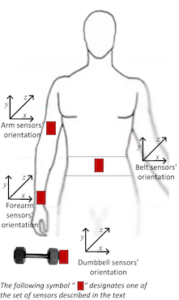

```{r setup_system, message=FALSE, echo=FALSE}
# Set up some global parameters
library(caret)
library(randomForest)
library(knitr)
library(ggplot2)

# opts_chunk$set(echo=FALSE)
```

## Summary

Six volunteers were asked to perform [dumbbell curls](http://exrx.net/WeightExercises/Biceps/DBCurl.html) correctly and in four common but incorrect variation. Motion sensor data was recorded at four points. A random forest model was trained to determine whether a repetition was performed correctly or, if incorrectly, in which incorrect variation.

## Introduction

A common mistake among beginning weightlifters is to emphasize raw weight numbers over correctly performing the exercises. This leads to inefficiencies and imbalance in muscle development and is an important contributer to acute muscle injuries. Although a personal trainer or experienced friend could provide real-time feedback on exercise form, the financial and time costs of this approach are not sustainable. Motion sensor data has the potential to fill this gap.

## Data

```{r setup_data}
train <- read.csv("pml-training.csv", na.strings = c("NA", "#DIV/0!"))
their_test <- read.csv("pml-testing.csv", na.strings = c("NA", "#DIV/0!"))

all_class <- train$classe

test_vars <- names(their_test[,!apply(their_test, 2, 
                                      FUN = function(x) any(is.na(x)))])
non_model_cols <- c(1:7, 60, 61)
non_model_vars <- names(train)[c(1:7,60,61)]

train <- train[, names(train) %in% c(test_vars, "classe")]

inTrain <- createDataPartition(train$classe, p = 0.75, list = FALSE)
train_data <- train[inTrain,]
test_data <- train[-inTrain,]

train_class <- train_data$classe
test_class <- test_data$classe

train_data <- train_data[,-non_model_cols]
test_data <- test_data[,-non_model_cols]
```

Velloso and coworkers recorded motion sensor data while volunteers performed a [unilaterial dumbbell bicep curls](http://exrx.net/WeightExercises/Biceps/DBCurl.html) correctly or according to common incorrect variations[^1]. The files are intermittently available from their [website](http://groupware.les.inf.puc-rio.br/har). Sensors were placed as follows:

* upper arm
* forearm
* belt/waist
* dumbbell

#### Sensor schematic (from Velloso _et al_).




Data were recorded continuously during each repetition. The plurality of data was collected with correct form (`'A'`), and the four incorrect forms were collected roughly equally.

``` {r, echo=FALSE, fig.width=6}
qplot(all_class, xlab = "class", main = "Count of samples in each class")
```

[^1]: Velloso, E.; Bulling, A.; Gellersen, H.; Ugulino, W.; Fuks, H. Qualitative Activity Recognition of Weight Lifting Exercises. Proceedings of the 4^th^ International Conference in Cooperation with SIGCHI (Augmented Human '13). Stuttgart, Germany: ACM SIGCHI, 2013.

## Analysis

### Model training

```{r process_fit, cache=TRUE}
train_preProcess <- preProcess(train_data, 
                               method = c("YeoJohnson", "knnImpute"))
train_pre <- predict(train_preProcess, newdata = train_data)
test_pre <- predict(train_preProcess, newdata = test_data)

train_pre_rf <- randomForest(x=train_pre, y=train_class)
train_mat <- confusionMatrix(train_class, predict(train_pre_rf, newdata = train_pre))
mat <- confusionMatrix(test_class, predict(train_pre_rf, newdata = test_pre))
```

Data were divided into a training (75%) and test (25%) sets. The training data was normalized using the Yeo-Johnson transformation. We observed that some entries contained `NA` values for one of the sensors. Those missing values were imputed using k-nearest neighbors as implemented in `caret`. 

The `caret` package was used to train a random forest model. The model gave Accuracy: `r 100*round(train_mat$overall["Accuracy"],3)`% and Kappa: `r 100*round(train_mat$overall["Kappa"],3)`%) on the training set.

### Model testing

The test data were transformed and imputed using the functions developed on the training set. When the trained model was applied to the test set, `r sum(mat$table) - sum(diag(mat$table))` out of `r sum(mat$table)` timepoints were  classified incorrectly (Accuracy: `r 100*round(mat$overall["Accuracy"],3)`%, Kappa: `r 100*round(mat$overall["Kappa"],3)`%).

We expect an **out of sample error** of `r 100*round(mat$overall["Accuracy"],3)`%, based on our 25% test set.


#### Test set confusion matrix

```{r confusion, fig.align='center'}
kable(mat$table)
```

This model was applied to the supplied test set, which results were submitted to Coursera for validation.

```{r for_submission, echo=FALSE}
# select out only useful columns

their_test_data <- their_test[, names(their_test) %in% names(train_data)]

their_test_pre <- predict(train_preProcess, newdata = their_test_data)
predict(train_pre_rf, newdata = their_test_pre)
```